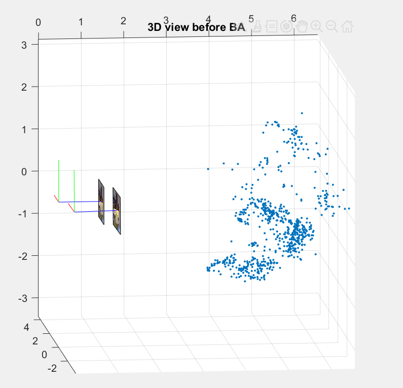
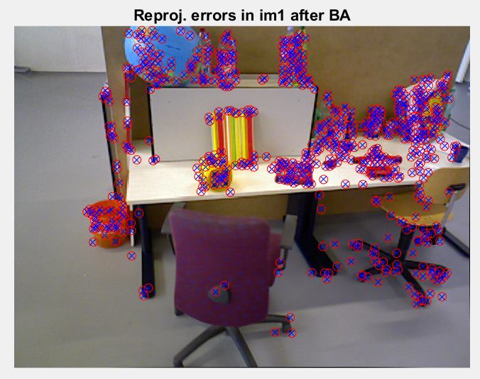
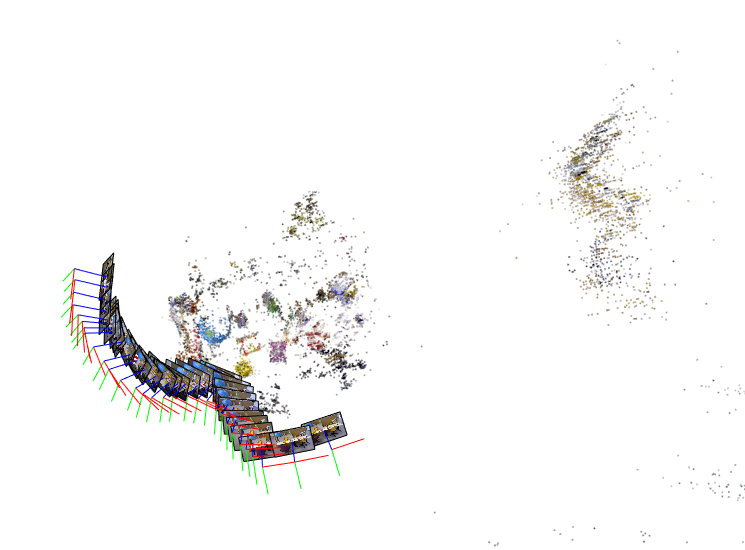
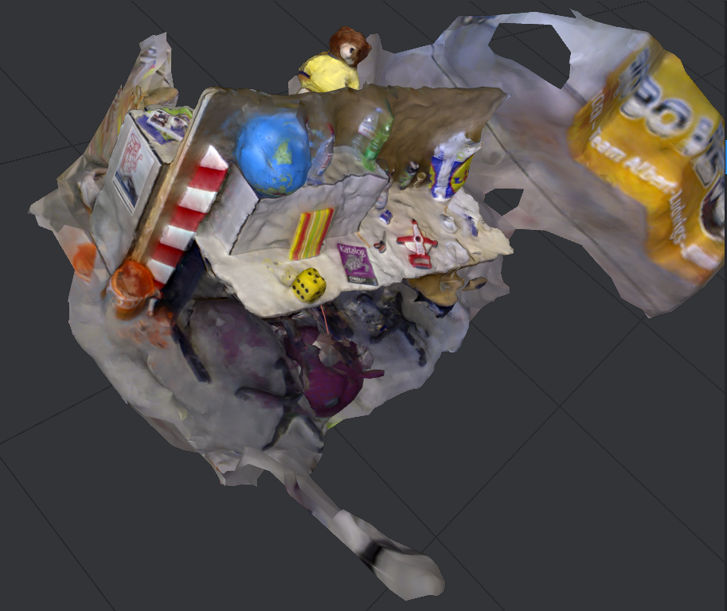

# Incremental 3D Scene Reconstruction   

---

## Project Overview  
This MATLAB-based project implements **incremental 3D reconstruction** from a sequence of images to estimate:  
- **3D point cloud** of the scene  
- **Camera poses** (rotation `R` and translation `t`) for each image  

Built as part of the ENSEIRB Matmeca curriculum, the pipeline follows the Structure from Motion (SfM) methodology, assuming pre-computed keypoint correspondences (outlier-free).  

---

## Key Features  
- **Incremental Reconstruction**: Adds images iteratively while refining poses and 3D points.  
- **Bundle Adjustment**: Minimizes reprojection error using the **Levenberg-Marquardt** algorithm.  
- **Sparse Jacobian Optimization**: Efficiently handles large-scale problems with MATLAB’s `sparse` matrices.  
- **Visualization**: Supports `pointCloud()` for interactive 3D exploration or `plot3()` for basic plotting.  
- **Error Analysis**: Tracks reprojection errors before/after refinement.  

---

## Theoretical Background

The reconstruction process relies on key concepts from **multi-view geometry**. Initially, two images are used to estimate their relative pose by decomposing the **fundamental matrix**, assuming known intrinsic parameters. From this, initial 3D points are reconstructed via **triangulation**. A **bundle adjustment** algorithm is then applied to jointly refine the 3D point positions and camera poses by minimizing the **reprojection error**.

As new images are introduced, the process becomes **incremental**:
1. **Localization** – The pose of the new camera is estimated using already triangulated 3D points.
2. **Triangulation** – New 3D points are computed using the newly added view.
3. **Refinement** – A global bundle adjustment is periodically applied to refine all poses and 3D points, using sparse optimization techniques for memory efficiency.

Finally, the reconstruction is visualized using colored 3D point clouds, enhancing both clarity and realism.

---

### Bundle Adjustment Cost Function

The optimization problem solved during bundle adjustment minimizes the reprojection error across all visible points in all images. The cost function is defined as:

$$\min_{\substack{\lbrace {R_{wj}, t_{wj}} \rbrace_{j=1,M} \\ \lbrace {u_i^{w}} \rbrace_{i=1...N} }} \sum_{j=1}^{M} \sum_{c=1}^{C_j} \left\| p_{j,p2DId(c)} - K\pi(R_{wj}^T(u_{p3DId(c)}^w-t_{wj})) \right\|_2^2$$

Where:

- $M$: Number of images (in the initialization step, $M = 2$).
- $C_j$: Number of 3D points observed in image $j$.
- $R_{wj},\ t_{wj}$: Rotation and translation matrices of image $j$.
- $u_i^w$: Reconstructed 3D points in world coordinates.
- $\texttt{p2DId}(c)$: Index of the 2D point among all detected points in image $j$.
- $\texttt{p3DId}(c)$: Index of the corresponding 3D point.
- $\pi(\cdot)$: Projection function that maps 3D points to 2D image coordinates.
- $K$: Intrinsic camera calibration matrix of the form:

$$
K = 
\begin{bmatrix}
f_x & 0 & c_x \\
0 & f_y & c_y
\end{bmatrix}
$$

where $f_x$, $f_y$ are the focal lengths in the $x$ and $y$ directions, and $c_x$, $c_y$ are the coordinates of the optical center in the image.

In this project, the matrix $K$ is defined as:

$$
K = 
\begin{bmatrix}
535 & 0 & 320 \\
0 & 539 & 247
\end{bmatrix}
$$

- $p_{j,\texttt{p2DId}(c)}$: The 2D point in image $j$ corresponding to the projection of the 3D point $u^w_{\texttt{p3DId}(c)}$.
---

### Jacobian Matrix Computation

To implement the **Levenberg–Marquardt algorithm** for bundle adjustment, we need to compute the derivative of the projection function with respect to the parameters $\{R_{wj},\ t_{wj}\}_{j=1}^{M}$ and $\{u_i^w\}_{i=1}^{N}$.

At each iteration, the updates are:

- $R_{wj}^{(l+1)} = R_{wj}^{(l)} \cdot \exp([\delta R_{wj}]^\wedge)$  
- $t_{wj}^{(l+1)} = t_{wj}^{(l)} + \delta t_{wj}$  
- $u_i^{w,(l+1)} = u_i^{w,(l)} + \delta u_i^w$

> Since rotation matrices lie in a Lie group, the increment $\delta R_{wj}$ is a 3D vector (3 degrees of freedom) converted to a rotation matrix via the matrix exponential.

The reprojection error is linearized as:

$$
p_{j,i} - K \cdot \pi\left( (R_{wj} \cdot \exp([\delta R_{wj}]^\wedge))^\top (u_i^w + \delta u_i^w - t_{wj} - \delta t_{wj}) \right) \approx r_{j,i} - J_{j,i} \delta
$$

Where:

- $r_{j,i} = p_{j,i} - K \cdot \pi(R_{wj}^\top (u_i^w - t_{wj}))$
- $\delta = \begin{bmatrix} \delta R_{w1} & \delta t_{w1} & \cdots & \delta R_{wM} & \delta t_{wM} & \delta u_1^w & \cdots & \delta u_N^w \end{bmatrix}^\top$

The Jacobian $J_{j,i}$ is defined as:

$$
J_{j,i} = 
\begin{bmatrix}
\begin{bmatrix}
f_x & 0 \\
0 & f_y
\end{bmatrix}
\cdot J_\pi \cdot
\begin{bmatrix}
J_{R_{w1}} & J_{t_{w1}} & \cdots & J_{R_{wM}} & J_{t_{wM}} & J_{u_1^w} & \cdots & J_{u_N^w}
\end{bmatrix}
\end{bmatrix}
$$

With:

- **Projection Jacobian**:

$$
J_\pi = 
\begin{bmatrix}
\frac{1}{z} & 0 & -\frac{x}{z^2} \\
0 & \frac{1}{z} & -\frac{y}{z^2}
\end{bmatrix}
$$

- **Rotation Jacobian**:

$$
J_{R_{wk}} = 
\begin{cases}
0, & \text{if } k \neq j \\
\left[ G_x^\top u_{ji} \quad G_y^\top u_{ji} \quad G_z^\top u_{ji} \right], & \text{if } k = j
\end{cases}
$$

Where:

$$
G_x =
\begin{bmatrix}
0 & 0 & 0 \\
0 & 0 & -1 \\
0 & 1 & 0
\end{bmatrix}, \quad
G_y =
\begin{bmatrix}
0 & 0 & 1 \\
0 & 0 & 0 \\
-1 & 0 & 0
\end{bmatrix}, \quad
G_z =
\begin{bmatrix}
0 & -1 & 0 \\
1 & 0 & 0 \\
0 & 0 & 0
\end{bmatrix}
$$

- **Translation and Point Jacobians**:

$$
J_{t_{wk}} =
\begin{cases}
0, & \text{if } k \neq j \\
-R_{wj}^\top, & \text{if } k = j
\end{cases}, \quad
J_{u_k^w} =
\begin{cases}
0, & \text{if } k \neq i \\
R_{wj}^\top, & \text{if } k = i
\end{cases}
$$

---

### Sparse Matrix Construction

Each iteration of Levenberg–Marquardt solves:

$$
\min_{\delta} \| r - J \delta \|^2 + \lambda \| \delta \|^2
$$

Which leads to solving:

$$
(J^\top J + \lambda I)\delta = J^\top r
$$

But when the number of cameras and 3D points becomes large, the matrix $J$ becomes too large and dense to store in memory or process efficiently.

To handle this, we use MATLAB's **`sparse`** matrix functionality to construct $J$ directly in sparse format.

Steps:

1. Create the index and value vectors `i`, `j`, and `v` for non-zero entries.
2. Fill these vectors during Jacobian construction.
3. Assemble the sparse matrix using:

matlab
J = sparse(i, j, v);

---

## Visual Results

### Initial Triangulation

---

### Bundle Adjustment – Before and After

<em>Left: Before adjustment – Right: After adjustment</em>

### Final 3D Reconstruction

> ℹ️ Make sure to place the images inside a folder named `images/` at the root of your repository.
